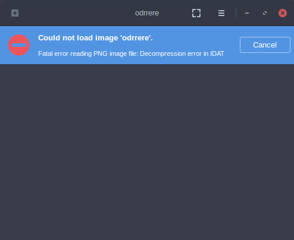
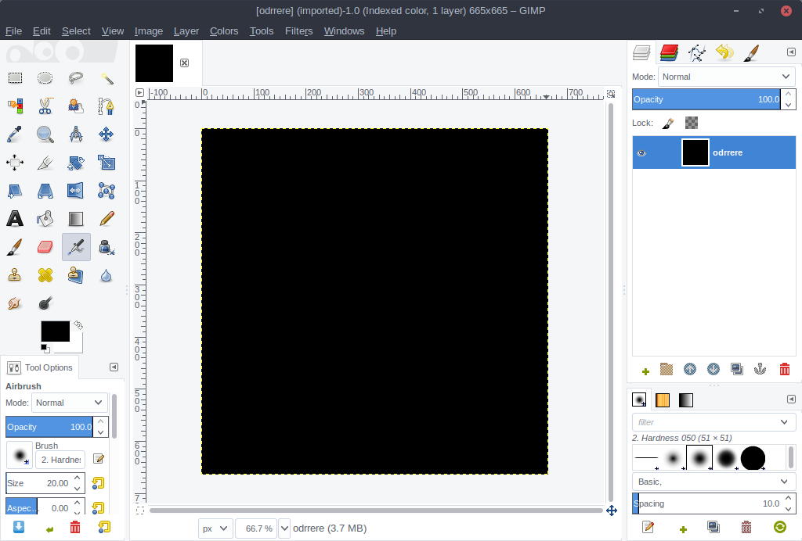
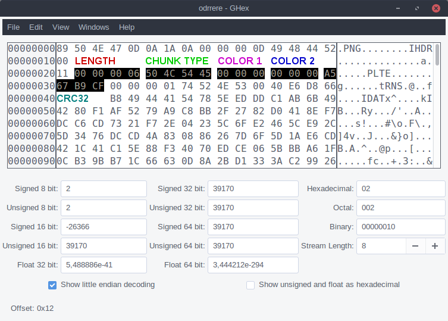
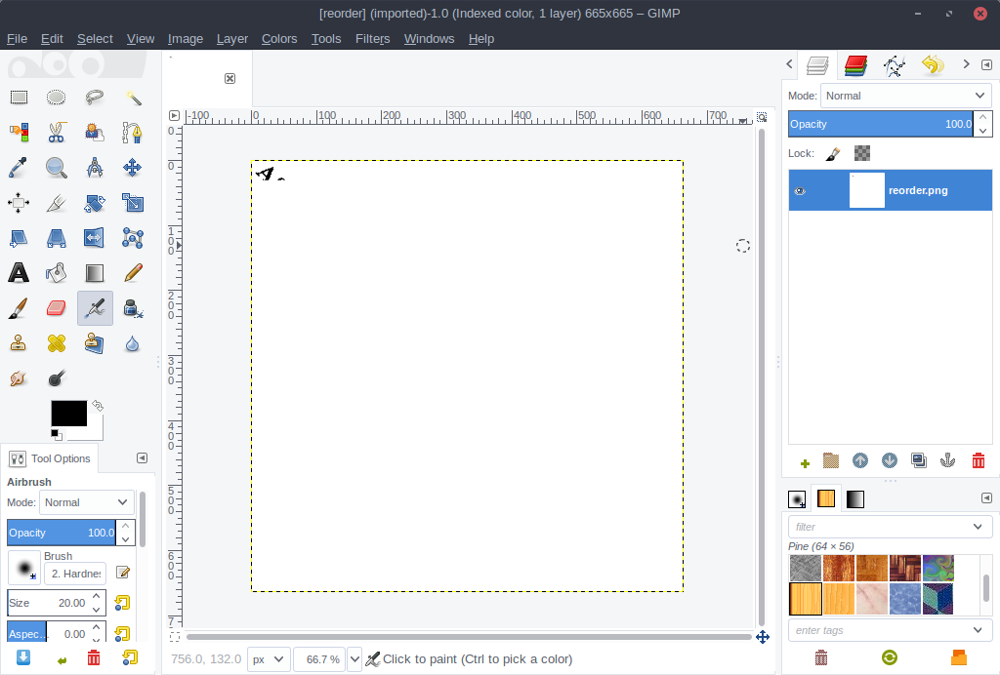
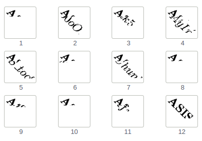

odrrere
=======

* **CTF:** [ASIS CTF Quals 2016](https://asis-ctf.ir/)
* **Category:** Forensic
* **Points:** 166
* **Solves:** 101

> > Chaos is merely order waiting to be deciphered
>
> José Saramago, The Double

We are given some file. What could it possibly be?

```
$ file odrrere
odrrere: PNG image data, 665 x 665, 1-bit colormap, non-interlaced
```

Oh, PNG image. Maybe we'll just try to open it?



That would be too easy. But what the heck is IDAT, why is there decompression error? Let's try to find something about PNG files and IDAT. We quickly arrive to PNG specification chapter about "Chunk Specifications".

First, we have file header (`89 50 4e 47 0d 0a 1a 0a` - note that `50 43 47` stands for `PNG` in ASCII), which allows software to recognize this file as PNG image and display it properly. PNG file contents consist of different chunks. Each chunk has its length (4 bytes), type (another 4 bytes), contents ($length bytes) and CRC32 checksum (4 bytes).

At the beginning, there is `IHDR` chunk, which describes image size, bit depth and color type (like indexed palette, RGB or grayscale). In images with indexed colors mode, `PLTE` chunk comes next and describes color values (R G B) for each of the colors in the palette. Then comes `IDAT` chunks which contain parts of image datastream (possibly compressed using zlib). `IEND` makes the end of file.

We've crafted quick script to check if chunks are correct (by validating their CRC32 checksums). Seems so. Hm, why this task has such strange name and description is talking about chaos and order? After a while, it becomes clear - the task name is anagram for reorder! So we just have to find correct order of chunks...

... well, not "just". While it is easy to check whether the order is valid (datastream would decompress without errors), there are 13 IDAT chunks, which means we would have to try 6227020800 possible permutations. With 50k tests per second, we would be able to complete this task in about 1.5 days. But we don't need to try all of them - we may try to place some data chunk at the beginning of datastream, try to open our image (with some viewer that doesn't care about errors) and manually check whether what we see makes sense or is just some random noise (because zlib is compressed stream, it'll decompress fine until first misplaced chunk; validation of whole stream is performed at the end of it).

It happens that GIMP is able to open such broken image (it only reports warning `Error loading PNG file: IDAT: invalid distance too far back` to the console). But...



Why is this image all black? Look at the GIMP titlebar - it says "Indexed color". Maybe we should check what are the colors in palette? We're not fluent with GIMP UI, so we've just grabbed hex editor and...



Yeah, both colors in the palette are equally black. We've changed second to be `FF FF FF` (white) and corrected CRC32 value. Let's try again now:



Looks like it's the begining of `ASIS{...}` :) So it seems that first chunk is already in its place. Let's try to put all remaining chunks as second one.



Definitely chunk number 12 is the second (original images were cropped for the brevity of this write-up).

We apply that procedure to the remaining 11 chunks and we finally get:


Final IDAT chunks order is 0 12 8 4 9 10 6 7 3 5 2 11 1.

Our helper script [reorder.py](reorder.py) is available in this repo.

One tine little detail: this flag was inconsistent with format specified in rules of CTF, as `!` (exclamation mark) was not permitted in the middle of the flag. :)
